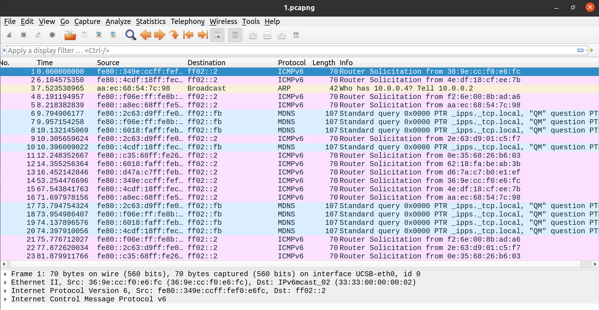
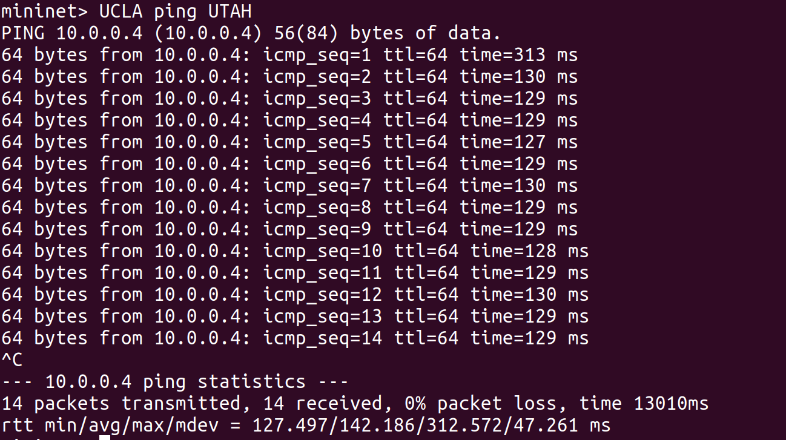

# SDN实验一   自学习交换机与广播环路

[TOC]


### 实验任务一：自学习交换机

#### （1）自学习交换机原理


a）控制器为每个交换机维护一个 mac-port 映射表。
b）控制器收到 packet_in 消息后，解析其中携带的数据包。
c）控制器学习 src_mac - in_port 映射。
d）控制器查询 dst_mac ，如果未学习，则洪泛数据包；如果已学习，则向指定端口转发数据包
( packet_out )，并向交换机下发流表项( flow_mod )，指导交换机转发同类型的数据包。

#### （2）自学习交换机Python代码

```python
from ryu.base import app_manager 
from ryu.controller import ofp_event 
from ryu.controller.handler import MAIN_DISPATCHER, CONFIG_DISPATCHER 
from ryu.controller.handler import set_ev_cls 
from ryu.ofproto import ofproto_v1_3 
from ryu.lib.packet import packet 
from ryu.lib.packet import ethernet 
class Switch(app_manager.RyuApp): 
    OFP_VERSIONS = [ofproto_v1_3.OFP_VERSION] 
    def __init__(self, *args, **kwargs): 
        super(Switch, self).__init__(*args, **kwargs)
        # maybe you need a global data structure to save the mapping 
        self.mac_to_port = {}
        #unit transmission table
         
    def add_flow(self, datapath, priority, match,actions,idle_timeout=0,hard_timeout=0):
        dp = datapath 
        ofp = dp.ofproto 
        parser = dp.ofproto_parser 
        inst = [parser.OFPInstructionActions(ofp.OFPIT_APPLY_ACTIONS, actions)] 
        mod = parser.OFPFlowMod(datapath=dp, priority=priority, 
                                idle_timeout=idle_timeout,
                                hard_timeout=hard_timeout,
        						match=match,instructions=inst) 
        dp.send_msg(mod) 
        
    @set_ev_cls(ofp_event.EventOFPSwitchFeatures, CONFIG_DISPATCHER) 
    def switch_features_handler(self, ev): 
        msg = ev.msg 
        dp = msg.datapath 
        ofp = dp.ofproto 
        parser = dp.ofproto_parser
        match = parser.OFPMatch() 
        actions = [parser.OFPActionOutput(ofp.OFPP_CONTROLLER,ofp.OFPCML_NO_BUFFER)] 
        self.add_flow(dp, 0, match, actions)
        
    @set_ev_cls(ofp_event.EventOFPPacketIn, MAIN_DISPATCHER) 
    def packet_in_handler(self, ev): 
        msg = ev.msg 
        dp = msg.datapath 
        ofp = dp.ofproto 
        parser = dp.ofproto_parser 
        
        # the identity of switch 
        dpid = dp.id 
        self.mac_to_port.setdefault(dpid,{}) 
        # the port that receive the packet 
        in_port = msg.match['in_port']
        pkt = packet.Packet(msg.data) 
        eth_pkt = pkt.get_protocol(ethernet.ethernet) 
        # get the mac 
        dst = eth_pkt.dst 
        src = eth_pkt.src 
        # we can use the logger to print some useful information 
        self.logger.info('packet: %s %s %s %s', dpid, src, dst, in_port)
        
        # you need to code here to avoid the direct flooding 
        # having fun 
        # :)
        
        # 学习mac地址到转发表
        self.mac_to_port[dpid][src] = in_port 
        #匹配到目的mac 则把转发端口号赋值给 outport
        #未匹配到 则洪泛
        if dst in self.mac_to_port[dpid]:
            out_port = self.mac_to_port[dpid][dst]
        else:
            out_port = ofp.OFPP_FLOOD
        #传递转发端口信息
        actions = [parser.OFPActionOutput(out_port)]

        # 下发流表给交换机，避免下一次packet_IN
        #如果转发端口不是洪泛，则match相应的信息（源和目的mac地址，端口等）
        if out_port != ofp.OFPP_FLOOD:
            match = parser.OFPMatch(in_port=in_port, eth_dst=dst, eth_src=src)
            # 根据buffer_id的有无添加流表项
            if msg.buffer_id != ofp.OFP_NO_BUFFER:
                self.add_flow(dp, 1, match, actions, msg.buffer_id)
                return
            else:
                self.add_flow(dp, 1, match, actions)
        data = None
        if msg.buffer_id == ofp.OFP_NO_BUFFER:
            data = msg.data
            
        #通过OFPPacketOut函数建立 packet_out msg
        out = parser.OFPPacketOut(datapath=dp, buffer_id=msg.buffer_id,in_port=in_port, actions=actions, data=data)
        dp.send_msg(out)

        
```

#### （3）运行结果及分析

使用`UCLA ping UTAH`，通过从UCSB端口抓到的数据包中不在包含UCLA ping UTAH 的相关数据包。





#### （4）相关代码设计思路

```python
def __init__(self, *args, **kwargs): 
        super(Switch, self).__init__(*args, **kwargs)
        self.mac_to_port = {}
```

代码段为初始化一个mac地址到port的映射，动态维护一个转发表

```
self.mac_to_port[dpid][src] = in_port #学习一个mac地址
if dst in self.mac_to_port[dpid]:
    out_port = self.mac_to_port[dpid][dst]
else:
    out_port = ofp.OFPP_FLOOD
```

若目的mac在mac_to_port中，则向相应的端口转发数据包；

若目的mac不在mac_to_port中，则洪泛。

```
if out_port != ofp.OFPP_FLOOD:
            match = parser.OFPMatch(in_port=in_port, eth_dst=dst, eth_src=src)
            # 根据buffer_id的有无添加流表项
            if msg.buffer_id != ofp.OFP_NO_BUFFER:
                self.add_flow(dp, 1, match, actions, msg.buffer_id)
                return
            else:
                self.add_flow(dp, 1, match, actions)
```

添加流表项，如果输出端口不是洪泛的情况下，需要根据buffer_id的有无，添加相应的流表项，完成数据包的转发。


### 实验任务二：广播环路

#### （1）广播风暴及其解决思路

广播风暴产生原因：

假设交换设备上没有启用stp协议，如果hostA发出广播请求hostB的mac地址，那么广播报文将被两台交换设备的端口1接收，并分别从端口2广播出去，然后端口2又收到另一台交换设备发过来的广播报文，再分别从两台交换设备的端口1转发，转发的同时会进行复制，如此反复，最终导致整个网络资源被耗尽，网络瘫痪不可用。

解决方案：

当序号为 dpid 的交换机从 in_port 第一次收到某个 src_mac 主机发出，询问 dst_ip 的广播 ARP Request 数据包时，控制器记录一个映射 (dpid, src_mac, dst_ip)->in_port 。下一次该交换机收到 同一 (src_mac, dst_ip) 但 in_port 不同的 ARP Request 数据包时直接丢弃，否则洪泛。

#### （2）广播环路Python代码

```python
from ryu.base import app_manager
from ryu.controller import ofp_event
from ryu.controller.handler import MAIN_DISPATCHER, CONFIG_DISPATCHER
from ryu.controller.handler import set_ev_cls
from ryu.ofproto import ofproto_v1_3
from ryu.lib.packet import packet
from ryu.lib.packet import ethernet
from ryu.lib.packet import arp
from ryu.lib.packet import ether_types

ETHERNET = ethernet.ethernet.__name__
ETHERNET_MULTICAST = "ff:ff:ff:ff:ff:ff"
ARP = arp.arp.__name__


class Switch_Dict(app_manager.RyuApp):
    OFP_VERSIONS = [ofproto_v1_3.OFP_VERSION]

    def __init__(self, *args, **kwargs):
        super(Switch_Dict, self).__init__(*args, **kwargs)
        self.sw = {}
        #(dpid, src_mac, dst_ip)=>in_port, you may use it in mission 2
        # maybe you need a global data structure to save the mapping
        # just data structure in mission 1
        self.mac_to_port = {}
        #unit transmission table
        

    def add_flow(self, datapath, priority, match, actions, idle_timeout=0, hard_timeout=0):
        dp = datapath
        ofp = dp.ofproto
        parser = dp.ofproto_parser
        inst = [parser.OFPInstructionActions(ofp.OFPIT_APPLY_ACTIONS, actions)]
        mod = parser.OFPFlowMod(datapath=dp, priority=priority,
                                idle_timeout=idle_timeout,
                                hard_timeout=hard_timeout,
                                match=match, instructions=inst)
        dp.send_msg(mod)

    @set_ev_cls(ofp_event.EventOFPSwitchFeatures, CONFIG_DISPATCHER)
    def switch_features_handler(self, ev):
        msg = ev.msg
        dp = msg.datapath
        ofp = dp.ofproto
        parser = dp.ofproto_parser
        match = parser.OFPMatch()
        actions = [parser.OFPActionOutput(ofp.OFPP_CONTROLLER, ofp.OFPCML_NO_BUFFER)]
        self.add_flow(dp, 0, match, actions)

    @set_ev_cls(ofp_event.EventOFPPacketIn, MAIN_DISPATCHER)
    def packet_in_handler(self, ev):
        msg = ev.msg
        dp = msg.datapath
        ofp = dp.ofproto
        parser = dp.ofproto_parser

        # the identity of switch
        dpid = dp.id
        self.mac_to_port.setdefault(dpid, {})
        # the port that receive the packet
        in_port = msg.match['in_port']
        pkt = packet.Packet(msg.data)
        eth_pkt = pkt.get_protocol(ethernet.ethernet)
        if eth_pkt.ethertype == ether_types.ETH_TYPE_LLDP:
            return
        if eth_pkt.ethertype == ether_types.ETH_TYPE_IPV6:
            return
        # get the mac
        dst = eth_pkt.dst
        src = eth_pkt.src
        # get protocols
        header_list = dict((p.protocol_name, p) for p in pkt.protocols if type(p) != str)
        if dst == ETHERNET_MULTICAST and ARP in header_list:
        
        #get arp.dst_ip
            arp_dst_ip = header_list[ARP].dst_ip
            if (dp.id, src, arp_dst_ip) in self.sw:  
                # Break the loop,drop packet
                if self.sw[(dp.id, src, arp_dst_ip)] != in_port:
                    out = dp.ofproto_parser.OFPPacketOut(datapath=dp,buffer_id=dp.ofproto.OFP_NO_BUFFER,in_port=in_port,actions=[], data=None)
                    dp.send_msg(out)
                    return True
            else:
                self.sw[(dp.id, src, arp_dst_ip)] = in_port
        # you need to code here to avoid broadcast loop to finish mission 2
        # self-learning
        
        
        
        self.mac_to_port[dpid][src] = in_port 
        
        if dst in self.mac_to_port[dpid]:
            out_port = self.mac_to_port[dpid][dst]
        else:
            out_port = ofp.OFPP_FLOOD

        actions = [parser.OFPActionOutput(out_port)]

        if out_port != ofp.OFPP_FLOOD:
            match = parser.OFPMatch(in_port=in_port, eth_dst=dst, eth_src=src)
            
            if msg.buffer_id != ofp.OFP_NO_BUFFER:
                self.add_flow(dp, 1, match, actions, msg.buffer_id)
                return
            else:
                self.add_flow(dp, 1, match, actions)
        data = None
        if msg.buffer_id == ofp.OFP_NO_BUFFER:
            data = msg.data

        out = parser.OFPPacketOut(datapath=dp, buffer_id=msg.buffer_id,in_port=in_port, actions=actions, data=data)
        dp.send_msg(out)
        
        
      
```

#### （3）实验结果与分析


UCLA与UTAH之间可以ping通，通过n_packet的数据，发现流表项的匹配次数明显减少。

#### （4）相关代码设计思路

```
self.sw = {}
```

设计控制器中(dpid, src_mac, dst_ip)对应in_port的映射。

```
#获取协议
header_list = dict((p.protocol_name, p) for p in pkt.protocols if type(p) != str)
#当协议的目的地址为广播并且为ARP时
if dst == ETHERNET_MULTICAST and ARP in header_list:
#获取ARP协议的目的ip地址
    arp_dst_ip = header_list[ARP].dst_ip
    #判定(dpid, src_mac, dst_ip)是否在sw中
    if (dp.id, src, arp_dst_ip) in self.sw:  
        #若(dpid, src_mac, dst_ip)不指向所本次事件的in_port，则丢掉数据包
        if self.sw[(dp.id, src, arp_dst_ip)] != in_port:
            out = dp.ofproto_parser.OFPPacketOut(datapath=dp,buffer_id=dp.ofproto.OFP_NO_BUFFER,in_port=in_port,actions=[], data=None)
            dp.send_msg(out)
            return True
    #若不在sw中，则学习一个对应映射
    else:
        self.sw[(dp.id, src, arp_dst_ip)] = in_port
```


### 实验心得：

在实验代码框架的基础上，动手编写RYU控制器程序，对控制器的工作原理有了更深刻的认识，对SDN的基本实现思路有了更深入的了解。SDN可以用来灵活解决了传统计算机网络中复杂困难的问题。
